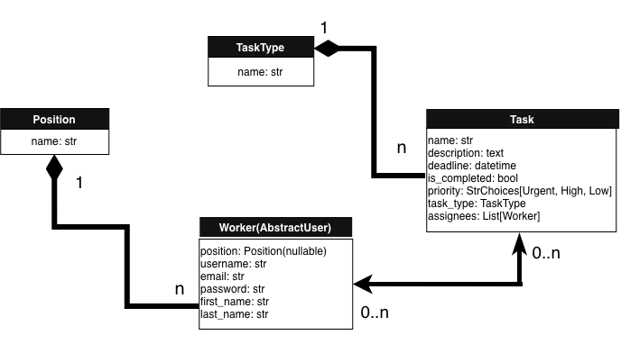
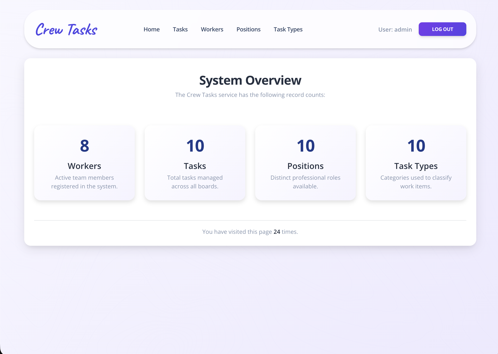
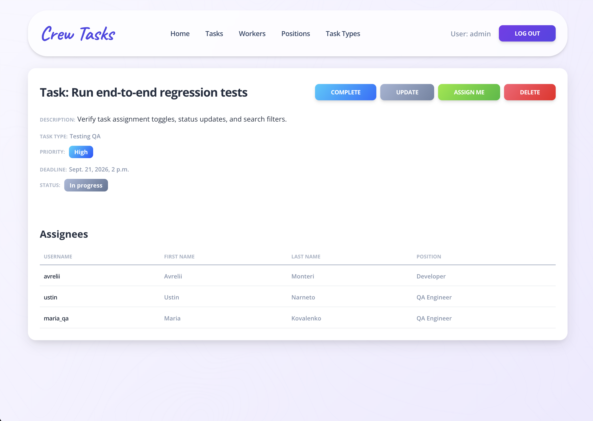
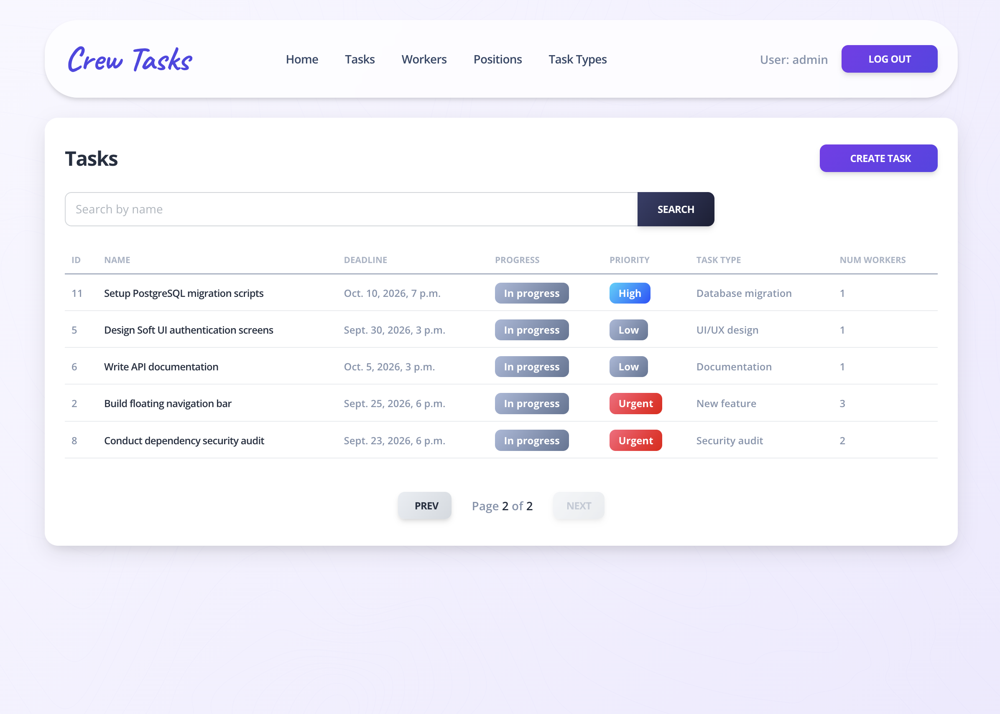

# Crew Tasks

A modern, responsive Django task management application built with a minimalist Soft UI design system and Bootstrap 5.

## Tech stack
* Python 3.14
* Django 6.1.1
* SQLite
* Bootstrap 5
* crispy-forms
* python-dotenv

## Features

### Backend
* **Custom User Model:** `Worker` extending Django's `AbstractUser`.
* **Relational Architecture:** 4 interconnected models with `ForeignKey` and `ManyToManyField`.
* **Class-Based Views:** Full CRUD implementation with optimized queries (`select_related`/`prefetch_related`).
* **Automated Tests:** 23 tests covering models, forms, and views.
* **Search Filtering:** Integrated via `ModelForm` and overridden `get_queryset`.
* **Authentication:** Login, registration, and view protection with `LoginRequiredMixin`.

### Frontend
* **Responsive UI:** Modern interface built with Bootstrap 5 and the Soft UI Design System.

## Database Schema


## Installation & Setup

1. **Clone the repository:**
   ```bash
   git clone https://github.com/AndriiOne/crew-tasks.git
   cd crew-tasks
   ```

2. **Create and activate a virtual environment:**
    ```bash
    python -m venv venv
    # On Windows:
    venv\Scripts\activate
    # On macOS/Linux:
    source venv/bin/activate
   ```

3. **Install dependencies:**
    ```bash
    pip install -r requirements.txt
   ```
   
4. **Set up environment variables:**
   ```bash
    cp .env.sample .env
   ```
   Then open `.env` and set your own `SECRET_KEY`
   ```bash
      python -c "from django.core.management.utils import get_random_secret_key; print(get_random_secret_key())"
   ```
   Copy the output and paste it as the SECRET_KEY value inside your .env file.

5. **Apply database migrations:**
    ```bash
    python manage.py migrate
   ```
   
6. **Create a superuser:**
    ```bash
    python manage.py createsuperuser
   ```
   
7. **Run the development server:**
    ```bash
   python manage.py runserver
   ```

## Demo Access
   
   You can log in using the pre-configured guest account:
   
   * **Username:** ustin
   * **Password:** PassTest1234

## Screenshots


