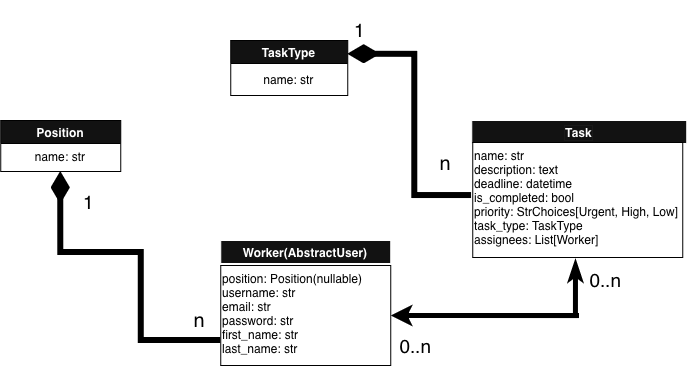
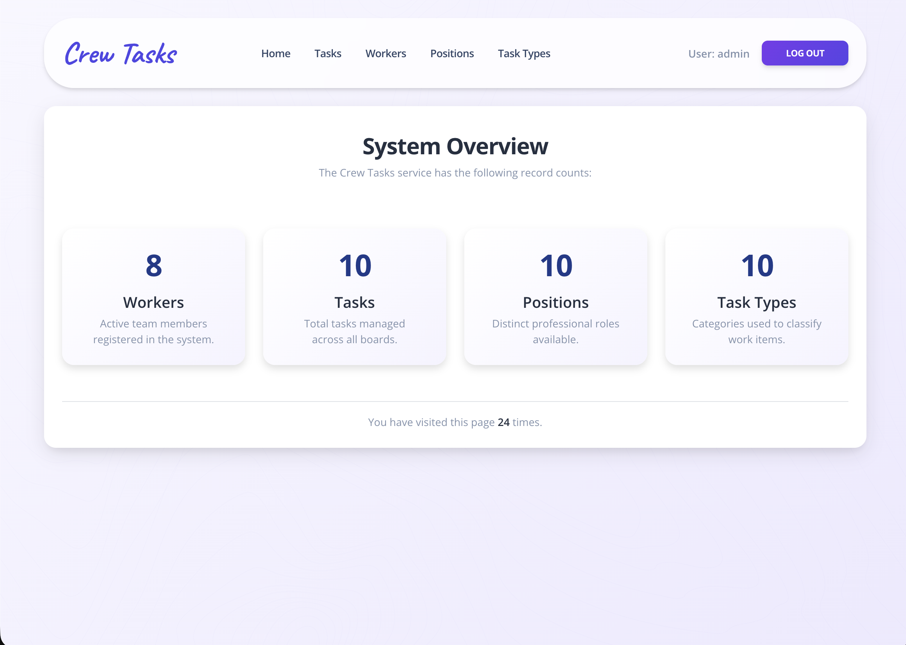
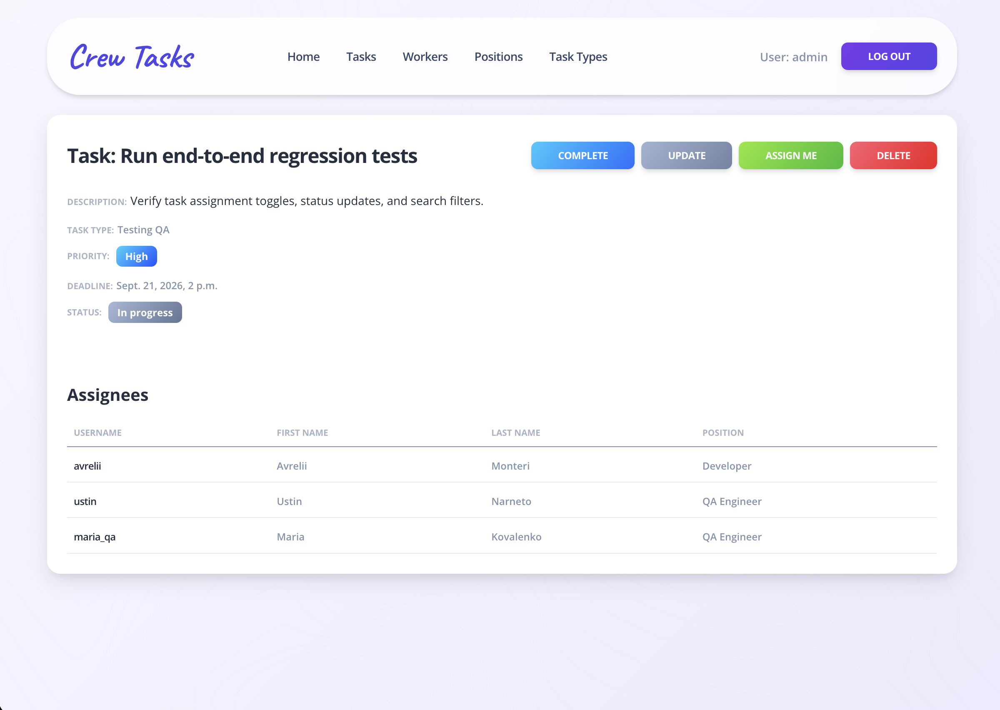
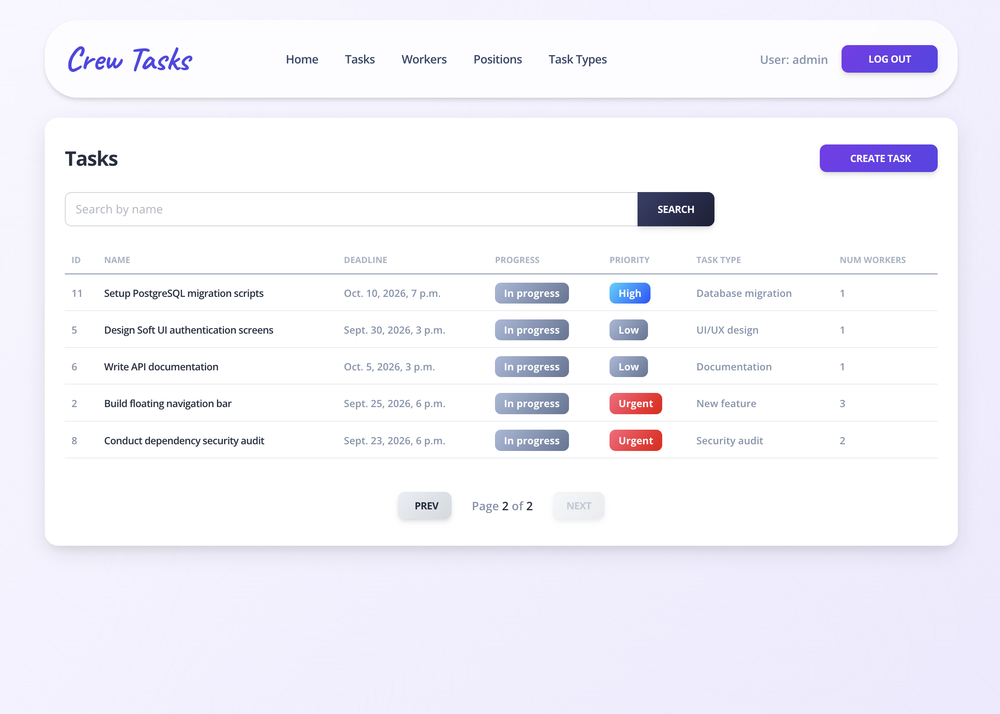

# Crew Tasks

A modern, responsive Django task management application built with a minimalist Soft UI design system and Bootstrap 5.

## Live demo

🔗 https://crew-tasks.onrender.com

You can create an account via the registration page.

> The app runs on Render's free tier, so the first load after a period of inactivity may take up to a minute.

## Tech stack

* Python 3.14
* Django 6.1.1
* SQLite (local development) / PostgreSQL on Neon (production)
* Bootstrap 5
* crispy-forms
* python-dotenv
* whitenoise, gunicorn
* Deployed on Render

## Features

### Backend

* **Custom User Model:** `Worker` extending Django's `AbstractUser`.
* **Relational Architecture:** 4 interconnected models with `ForeignKey` and `ManyToManyField`.
* **Class-Based Views:** Full CRUD implementation with optimized queries (`select_related`/`prefetch_related`).
* **Automated Tests:** 23 tests covering models, forms, and views.
* **Search Filtering:** Integrated via `ModelForm` and overridden `get_queryset`.
* **Authentication:** Login, registration, and view protection with `LoginRequiredMixin`.

### Frontend

* **Responsive UI:** Modern interface built with Bootstrap 5 and the Soft UI Design System.

## Database Schema



## Installation & Setup

1. **Clone the repository:**

```bash
   git clone https://github.com/AndriiOne/crew-tasks.git
   cd crew-tasks
```

2. **Create and activate a virtual environment:**

```bash
   python -m venv venv
   # On Windows:
   venv\Scripts\activate
   # On macOS/Linux:
   source venv/bin/activate
```

3. **Install dependencies:**

```bash
   pip install -r requirements.txt
```

4. **Set up environment variables:**

```bash
   cp .env.sample .env
```

   Open `.env`, set `DJANGO_SETTINGS_MODULE=crew_tasks.settings.dev` for local development, and generate your own `SECRET_KEY`:

```bash
   python -c "from django.core.management.utils import get_random_secret_key; print(get_random_secret_key())"
```

   Copy the output and paste it as the `SECRET_KEY` value inside your `.env` file.

5. **Apply database migrations:**

```bash
   python manage.py migrate
```

6. **Load demo data (optional):**

```bash
   python manage.py loaddata dump.json
```

7. **Create a superuser:**

```bash
   python manage.py createsuperuser
```

8. **Run the development server:**

```bash
   python manage.py runserver
```

## Screenshots




